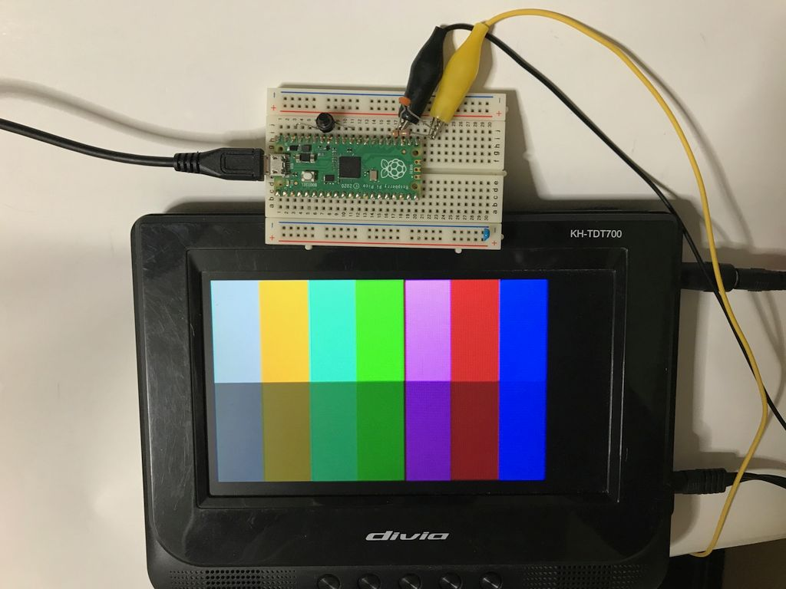
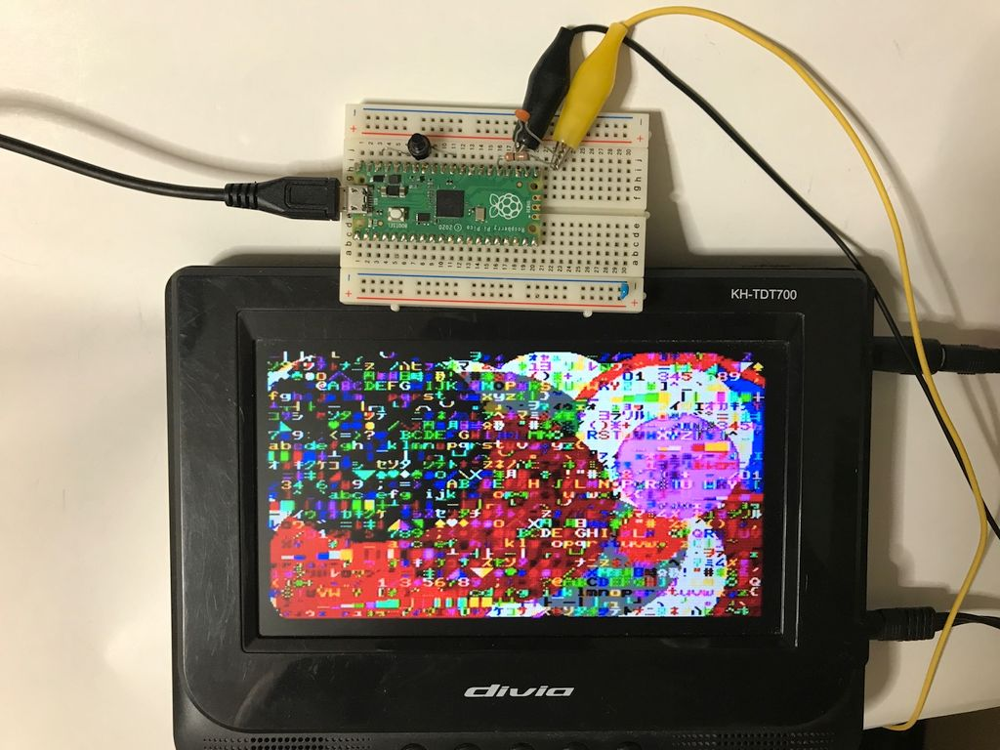

# NTSC Video output for Raspberry Pi Pico(Text and Graphic) (C SDK)
Raspberry Pi PicoのPWM出力のみでNTSCビデオ出力するライブラリです。  
らびやん氏の以下を参考に作成しました。  
https://gist.github.com/lovyan03/b50333fa917371bd92b4b5f2e7a67e89  
42文字カラーテキスト、336x216ドットカラーグラフィック、80文字モノクロテキストが利用可能です。グラフィックモードではテキストとの重ね合わせ出力を行います。  
## 接続
GP19（25番ピン）から映像信号が出力されます。  
グランドとGP19を直接映像機器のビデオ入力に接続しただけで映ることもありますが、GP19と映像機器の間に75Ω程度の抵抗をはさみ、グランドとの間に560pF程度のコンデンサを入れたほうがチラつきが減る場合があるようです。  
  
GP19 -- 75 ohm --- Video Out  
　　　　　　　　|  
　　　　　　　=== 560 pF  
　　　　　　　　|  
　　　　　　　GND  
  
## 利用方法
Raspberry Pi Pico C SDKを利用します。詳しい使い方はデモ用プログラムmain.cを参考にしてください。  
アプリケーション側で最初にinit_composite(n)関数を呼び出すことでGPIOのn番からビデオ出力が開始されます。  
標準では横42文字のカラーテキスト専用モードとなっています。カラーグラフィックを利用する場合、アプリケーション側でグラフィック用メモリの確保が必要なことに注意してください。以下の配列宣言で領域確保し、set_videomode()関数でグラフィックモードに設定します。  
  
    uint8_t framebuffer[X_RES*Y_RES] __attribute__ ((aligned (4)));  
    set_videomode(VMODE_WIDEGRPH,framebuffer);  
  
モノクロ80文字モードを利用する場合は、以下のように設定します。  
  
    set_videomode(VMODE_MONOTEXT,0); //第2パラメータはダミー  
  
テキストはPCG (programmable character generator)に対応しています。以下のような配列を用意し、文字コードx8バイト目から8バイト書き込むことで任意の8x8ドットフォントパターンを定義することができます。  

    uint8_t fontram[256*8];  
    startPCG(fontram,1); //第2パラメータに0以外を指定すると標準フォントで初期化  
  
  
  
